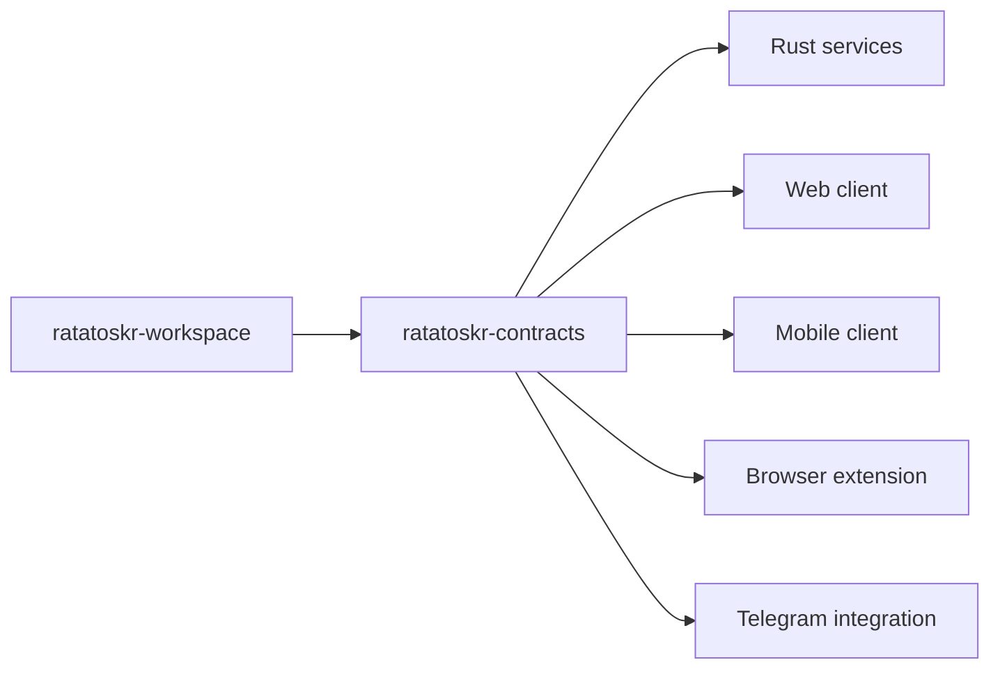
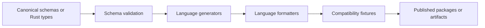

# Ratatoskr Contracts Architecture

> Status: target contract architecture. Schemas and generated packages described here become authoritative only after their generators, compatibility checks, and release process exist.

## 1. Purpose

`ratatoskr-contracts` is the system-of-record for public and inter-service wire contracts used by Ratatoskr repositories. It standardizes how services exchange commands, events, API payloads, identifiers, errors, operation state, documents, social sources, and AI archive records.

The repository exists to make distributed evolution explicit and testable. It is not a shared domain model, shared ORM layer, or general utilities repository.

## 2. Architectural position



Services own domain behavior and persistence. This repository owns only serialized boundaries and the rules required to evolve them safely.

## 3. Repository structure

```text
ratatoskr-contracts/
├── crates/
│   ├── identifiers/
│   ├── event-envelope/
│   ├── operation-contracts/
│   ├── document-contracts/
│   ├── social-contracts/
│   ├── ai-archive-contracts/
│   └── error-contracts/
├── schemas/
│   ├── events/
│   ├── json-schema/
│   └── openapi/
├── generated/
│   ├── rust/
│   ├── typescript/
│   ├── kotlin/
│   └── swift/
├── fixtures/
├── tools/
├── docs/
└── Cargo.toml
```

Generated language targets may be released as packages rather than committed permanently. The generation strategy must be deterministic and documented before implementation.

## 4. Canonical sources

Every contract has one canonical source. Generated artifacts are never edited by hand.

Recommended ownership:

| Contract family | Canonical source |
|---|---|
| Rust-first value types | Rust type plus generated JSON Schema |
| Public HTTP API | OpenAPI document generated from Platform routes or contract definitions |
| Event payloads | Versioned JSON Schema and matching Rust type |
| Cross-language client models | Generated from JSON Schema or OpenAPI |
| Examples and compatibility fixtures | Hand-authored immutable fixtures validated against canonical schema |

A contract must not have independently maintained Rust, TypeScript, Kotlin, and Swift definitions.

## 5. Contract families

### 5.1. Identifiers

Shared identifiers describe wire identity, not database implementation.

```rust
pub struct UserId(pub Uuid);
pub struct OperationId(pub Uuid);
pub struct EventId(pub Uuid);
pub struct CorrelationId(pub Uuid);
pub struct BlobRef(pub String);
```

Requirements:

- UUIDv7 for newly generated internal IDs unless a provider supplies a stable external numeric/string ID;
- provider IDs remain opaque strings or bounded numeric wrappers;
- no database primary-key types leak into public payloads;
- identifier string formats are stable and validated.

### 5.2. Event envelope

All domain events use a common envelope.

```json
{
  "event_id": "018f0000-0000-7000-8000-000000000001",
  "event_type": "content.document.extracted.v1",
  "occurred_at": "2026-08-17T10:00:00Z",
  "producer": "ratatoskr-extractor",
  "aggregate_id": "document:018f0000-0000-7000-8000-000000000002",
  "correlation_id": "operation:018f0000-0000-7000-8000-000000000003",
  "causation_id": "event:018f0000-0000-7000-8000-000000000004",
  "tenant_id": "user:018f0000-0000-7000-8000-000000000005",
  "schema_version": 1,
  "payload": {}
}
```

Envelope fields are stable across event families. Payloads are versioned independently through `event_type` major versions.

### 5.3. Commands

Commands request work and may be rejected. They are not facts.

A command contract includes:

- command ID;
- command type and version;
- actor and tenant context;
- correlation and causation IDs;
- idempotency key;
- requested-at timestamp;
- payload;
- optional deadline or priority.

Consumers must not interpret command receipt as completion.

### 5.4. Operations

Long-running work is represented by a public operation contract.

```text
accepted
queued
running
succeeded
partially_succeeded
failed
cancelled
```

The operation schema includes:

- stable `operation_id`;
- operation kind;
- current status;
- progress stage and optional bounded percentage;
- structured result references;
- structured errors and warnings;
- timestamps;
- retryability;
- correlation information.

Progress is monotonic in lifecycle semantics even when a percentage is not.

### 5.5. Error contracts

Errors have stable machine-readable codes and human-readable messages.

```rust
pub struct ErrorEnvelope {
    pub code: String,
    pub message: String,
    pub retryable: bool,
    pub details: Option<serde_json::Value>,
    pub trace_id: Option<String>,
}
```

Rules:

- no stack traces or secrets in wire errors;
- provider responses are normalized into service-owned error codes;
- validation errors identify safe field paths;
- retryability is explicit;
- partial-success warnings are distinct from terminal errors.

## 6. Document contracts

### 6.1. Canonical Document IR

The normalized document is structured, not Markdown-first.

```rust
pub struct Document {
    pub document_id: DocumentId,
    pub metadata: DocumentMetadata,
    pub blocks: Vec<Block>,
    pub provenance: Vec<SourceSpan>,
    pub content_hash: String,
    pub schema_version: u32,
}
```

Representative blocks:

```rust
pub enum Block {
    Heading { level: u8, text: String },
    Paragraph { text: String },
    List { ordered: bool, items: Vec<String> },
    Quote { text: String },
    Code { language: Option<String>, text: String },
    Table { rows: Vec<Vec<String>> },
    Image { source: String, alt: Option<String> },
    Unknown { kind: String, value: serde_json::Value },
}
```

`Unknown` preserves forward compatibility. Rendered Markdown, HTML, plain text, and LLM context are derived representations.

### 6.2. Provenance

Provenance connects normalized blocks to source evidence:

- source URL or blob;
- byte, DOM, page, or provider-object location;
- extraction strategy;
- observed timestamp;
- optional confidence.

Consumers may display citations without depending on extractor-private storage.

## 7. Social contracts

Social sources preserve acquisition method and saved-state authority.

```rust
pub enum AcquisitionMethod {
    OfficialApi,
    ShareExtension,
    BrowserExtension,
    DataExport,
    LegacyImport,
}

pub enum SavedAuthority {
    AuthoritativePlatformState,
    ExplicitUserCapture,
    ExportObservation,
    LegacyObservation,
}
```

A normalized social source includes:

- platform and external ID;
- canonical URL;
- owner user;
- author;
- published and captured timestamps;
- text and media descriptors;
- quote/reply/repost relations;
- native collection references;
- content hash and raw blob reference;
- upstream availability state.

The contract must not collapse an Instagram capture and an X bookmark into the same boolean `is_saved` semantics.

## 8. AI archive contracts

### 8.1. Provider export

A provider export contract records immutable archive evidence, parser identity, detected schema, import timestamps, completeness, and warnings.

### 8.2. Projects and conversations

Project contracts support:

- title, description, instructions, and visibility;
- project knowledge or sources;
- provider IDs and timestamps;
- first/last observed snapshot;
- external references.

Conversations are graphs. Messages include an optional parent ID and heterogeneous content parts.

```rust
pub enum ContentPart {
    Text(String),
    Markdown(String),
    Image(BlobRef),
    File(AttachmentRef),
    Code(CodeBlock),
    Citation(Citation),
    ToolCall(ToolCall),
    ToolResult(ToolResult),
    Artifact(ArtifactRef),
    Canvas(CanvasRef),
    Unknown(serde_json::Value),
}
```

Unknown provider variants must survive normalization and re-export.

### 8.3. Completeness

```text
complete
conversations_complete
structurally_partial
assets_partial
unknown
failed_validation
```

Completeness is evidence-based. A parser may not mark an export complete merely because it parsed every known file.

## 9. Naming and versioning

### 9.1. Event names

```text
<bounded_context>.<aggregate>.<action>.v<major>
```

Examples:

```text
content.document.extracted.v1
github.repository.observed.v1
vault.snapshot.verified.v1
social.source.upserted.v1
chatgpt.export.ingested.v1
knowledge.analysis.completed.v1
platform.operation.progressed.v1
```

### 9.2. Version rules

- additive optional fields are backward-compatible when consumers tolerate absence;
- required-field changes require a new major contract version;
- semantic reinterpretation requires a new version even if JSON shape is unchanged;
- enum additions are compatible only when consumers preserve or safely reject unknown values;
- removing fields or variants requires a coordinated later phase;
- timestamps use RFC 3339 UTC on the wire unless a local offset is itself meaningful data.

## 10. Compatibility process

All cross-repository changes follow expand, migrate, contract.

### Expand

Add a new optional field, event version, endpoint version, or parallel representation. Existing consumers continue to work.

### Migrate

Update consumers first, then producers. Run old/new fixtures, replay tests, and integration profiles.

### Contract

Remove deprecated forms only after all pinned consumers have migrated and the workspace snapshot proves compatibility.

Breaking changes require a workspace changeset with producer, consumer, rollout, rollback, and data-migration analysis.

## 11. Generation pipeline



The pipeline must be deterministic. A clean checkout running the generator produces no diff after committed/generated artifacts are current.

Generated outputs include a provenance header containing generator version, source digest, and contract version.

## 12. Testing architecture

Required test layers:

- JSON Schema validation;
- Rust serialization round trips;
- canonical fixture validation;
- old-consumer/new-producer compatibility fixtures;
- new-consumer/old-producer compatibility fixtures;
- unknown enum/content-part preservation;
- OpenAPI linting;
- generated client compilation;
- deterministic generation checks;
- property tests for identifiers, timestamps, and envelopes.

Fixtures must use synthetic data and must not contain provider tokens, private exports, personal messages, or real user identifiers.

## 13. Release architecture

Contract artifacts are versioned independently by family where practical, while a repository release records a compatible aggregate snapshot.

A release includes:

- source schemas;
- generated packages or artifact references;
- changelog by contract family;
- compatibility classification;
- migration notes;
- deprecated versions and removal dates;
- source and generator digests.

Workspace pins define which contract release is compatible with each service revision.

## 14. Security and privacy

- Secrets and credentials are never contract fields unless the contract is an internal encrypted-secret envelope explicitly designed for that purpose.
- Examples and fixtures are synthetic.
- Error payloads exclude stack traces and raw provider responses by default.
- Blob references are opaque and do not expose filesystem paths or signed storage URLs.
- User content fields are clearly separated from metadata so logs and telemetry can omit content.
- Authorization context is explicit on public and internal commands but does not grant access by itself.
- Provider-specific raw payloads use bounded `metadata` or `unknown` fields and are not propagated indiscriminately.

## 15. Architectural invariants

1. This repository owns wire contracts, not business behavior.
2. Every contract has one canonical source.
3. Generated artifacts are never hand-edited.
4. Events represent facts; commands request work.
5. Long-running work uses operation contracts.
6. At-least-once delivery is assumed, so IDs and idempotency fields are first-class.
7. Document IR remains structured and preserves unknown blocks.
8. Social contracts preserve acquisition and authority semantics.
9. AI archive contracts model conversation graphs and unknown content parts.
10. Breaking changes use expand, migrate, contract and a workspace changeset.
11. Fixtures contain no production or personal data.
12. Shared contracts never become shared persistence entities.

## 16. Evolution

Initial milestones:

1. Establish identifiers, event envelope, error, and operation crates.
2. Define JSON Schema generation and deterministic checks.
3. Add Document IR and fixtures shared by Extractor and Knowledge.
4. Add social contracts for X, Instagram, Threads, mobile, and browser capture.
5. Add AI archive contracts for ChatGPT, Claude, and Export Agent.
6. Generate the first TypeScript and Rust artifacts.
7. Add Kotlin and Swift outputs when mobile integration starts.
8. Publish versioned artifacts and integrate workspace compatibility checks.

Architecture decisions that change canonical-source strategy, versioning, or release policy must be recorded as ADRs and reflected in `AGENTS.md`.
