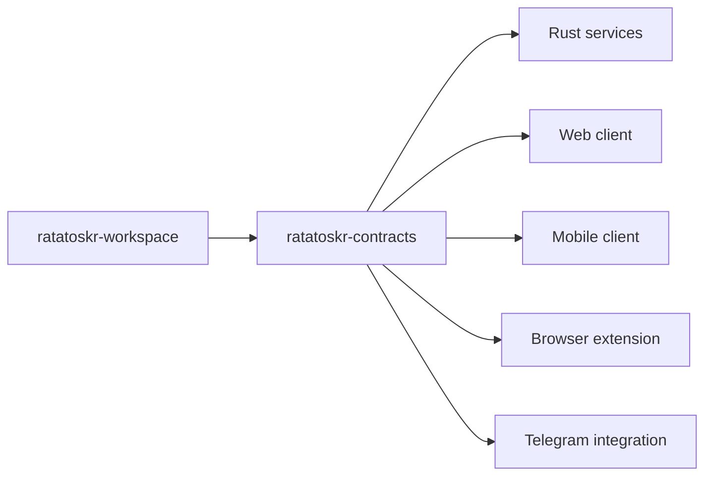
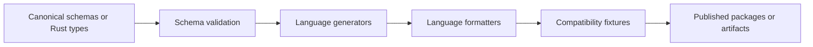

# Ratatoskr Contracts Architecture

> Status: target contract architecture. Schemas and generated packages described here become authoritative only after their generators, compatibility checks, and release process exist.

## 1. Purpose

`ratatoskr-contracts` is the system-of-record for public and inter-service wire contracts used by Ratatoskr repositories. It standardizes how services exchange commands, events, API payloads, identifiers, errors, operation state, documents, social sources, and AI archive records.

The repository exists to make distributed evolution explicit and testable. It is not a shared domain model, shared ORM layer, or general utilities repository.

## 2. Architectural position



Services own domain behavior and persistence. This repository owns only serialized boundaries and the rules required to evolve them safely.

## 3. Repository structure

```text
ratatoskr-contracts/
├── crates/
│   ├── identifiers/
│   ├── event-envelope/
│   ├── operation-contracts/
│   ├── document-contracts/
│   ├── social-contracts/
│   ├── ai-archive-contracts/
│   ├── backup-contracts/
│   ├── notification-contracts/
│   └── error-contracts/
├── schemas/
│   ├── events/
│   ├── json-schema/
│   └── openapi/
├── generated/
│   ├── rust/
│   ├── typescript/
│   ├── kotlin/
│   └── swift/
├── fixtures/
├── tools/
├── docs/
└── Cargo.toml
```

Generated language targets may be released as packages rather than committed permanently. The generation strategy must be deterministic and documented before implementation.

## 4. Canonical sources

Every contract has one canonical source. Generated artifacts are never edited by hand.

Recommended ownership:

| Contract family | Canonical source |
|---|---|
| Rust-first value types | Rust type plus generated JSON Schema |
| Public HTTP API | OpenAPI document generated from Platform routes or contract definitions |
| Event payloads | Versioned JSON Schema and matching Rust type |
| Cross-language client models | Generated from JSON Schema or OpenAPI |
| Examples and compatibility fixtures | Hand-authored immutable fixtures validated against canonical schema |

A contract must not have independently maintained Rust, TypeScript, Kotlin, and Swift definitions.

## 5. Contract families

### 5.1. Identifiers

Shared identifiers describe wire identity, not database implementation.

```rust
pub struct UserId(pub Uuid);
pub struct OperationId(pub Uuid);
pub struct EventId(pub Uuid);
pub struct CorrelationId(pub Uuid);
pub struct BlobRef {
    pub owner_service: BlobOwner,
    pub digest: ContentDigest,
    pub media_type: MediaType,
    pub length_bytes: u64,
}
```

Requirements:

- UUIDv7 for newly generated internal IDs unless a provider supplies a stable external numeric/string ID;
- provider IDs remain opaque strings or bounded numeric wrappers;
- no database primary-key types leak into public payloads;
- identifier string formats are stable and validated;
- wire form follows the three-clause rule below (ADR-0007).

**Wire form of an identifier field** (ADR-0007). This rule governs the fields of the contracts in this repository. It is descriptive of what ships; it is not asserted over identifier fields owned by other repositories.

1. A field carrying the record's **own** identity is a bare canonical lowercase-hyphenated UUID in a typed newtype: `event_id`, `operation_id`.
2. A field **pointing at** another Ratatoskr domain record is `<kind>:<local_id>`, because a pointer's referent kind must be readable from the value alone: `aggregate_id`, `correlation_id`, `causation_id`, `tenant_id`. The kind vocabulary is open (`EntityRef`) unless authorization requires it closed (`TenantRef`).
3. A handle to a **non-domain external system** keeps that system's own grammar in its own validated newtype: the error envelope's `trace_id` is bare 32-hex because W3C Trace Context fixes that spelling. Clause 3 applies only where an external specification already fixes the spelling; it is not a general exemption from clause 2. `BlobRef` is not an identifier newtype: it is a structured reference naming the owner, digest, media type and byte length.

A local identity that is a UUID has exactly one accepted spelling, the canonical lowercase hyphenated one. A local identity that is not a UUID stays fully opaque and case-sensitive.

### 5.2. Event envelope

All domain events use a common envelope.

```json
{
  "event_id": "018f0000-0000-7000-8000-000000000001",
  "event_type": "content.document.extracted.v1",
  "occurred_at": "2026-08-17T10:00:00Z",
  "producer": "ratatoskr-extractor",
  "aggregate_id": "document:018f0000-0000-7000-8000-000000000002",
  "correlation_id": "operation:018f0000-0000-7000-8000-000000000003",
  "causation_id": "event:018f0000-0000-7000-8000-000000000004",
  "tenant_id": "user:018f0000-0000-7000-8000-000000000005",
  "schema_version": 1,
  "payload": {}
}
```

Envelope fields are stable across event families. Payloads are versioned independently through `event_type` major versions.

**The two version axes** (ADR-0002, confirmed). `event_type`'s `.v<major>` suffix is the one and only major of the **payload** contract. `schema_version` is the one and only major of the **envelope** contract. They describe different objects, so they can never agree or disagree and neither mirrors the other. A build that does not understand the envelope major refuses the message rather than half-reading it. No other contract in this repository may name a property `schema_version`; a payload that needs its own version names it after what it versions, for example `document_ir_version`. `cargo contracts check` rule L8 enforces that.

### 5.3. Commands

Commands request work and may be rejected. They are not facts.

A command contract includes:

- command ID;
- command type, whose `.v<major>` suffix is the payload major;
- envelope schema version;
- actor and tenant context;
- correlation and causation IDs;
- idempotency key;
- requested-at timestamp;
- payload;
- optional deadline or priority.

Consumers must not interpret command receipt as completion.

### 5.4. Operations

Long-running work is represented by a public operation contract.

```text
accepted
queued
running
succeeded
partially_succeeded
failed
cancelled
```

The operation schema includes:

- stable `operation_id`;
- operation kind;
- current status;
- progress stage and optional bounded percentage;
- structured result references;
- structured errors and warnings;
- timestamps;
- retryability;
- correlation information.

Progress is monotonic in lifecycle semantics even when a percentage is not.

### 5.5. Error contracts

Errors have stable machine-readable codes and human-readable messages.

```rust
pub struct ErrorEnvelope {
    pub code: ErrorCode,
    pub message: SafeMessage,
    pub retryable: bool,
    pub field_violations: Vec<FieldViolation>,
    pub correlation_id: Option<EntityRef>,
    pub trace_id: Option<TraceId>,
    pub extensions: Extensions,
}
```

Rules:

- no stack traces or secrets in wire errors;
- provider responses are normalized into service-owned error codes;
- validation errors identify safe field paths, carried in `field_violations`;
- retryability is explicit;
- partial-success warnings are distinct from terminal errors;
- there is no untyped `details` member on this contract (ADR-0008). An earlier draft of this block declared `details: Option<serde_json::Value>`. It is gone: the contract is classified `public`, and an unbounded free-JSON member on a public error is the carrier S14 and `THREAT_MODEL.md` are written against. Where a producer later needs to carry provider diagnostics, the sanctioned path is S14's bounded `metadata`/`unknown` shape — a discriminated `{kind, value}` carrier — on an `internal`-classified contract, not a free blob here.

### 5.6. Backup policy contracts

GitHub states which repositories must be preserved and at what depth; Vault answers each published version with an acknowledgment event.

```rust
pub struct DesiredBackupPolicy {
    pub policy_version: u64,
    pub producing_service: ProducerName,
    pub produced_at: WireTimestamp,
    pub repositories: Vec<RepositoryBackupEntry>,
    pub extensions: Extensions,
}
```

Rules:

- versions are monotonic and start above zero; succession between two documents is checked by `validate_policy_succession`, because one document cannot know its predecessor;
- entries name repositories by the shared pointer grammar (`repository:<uuid>`), and two entries of one version never name the same repository;
- cadence class, priority hint, outcome and rejection codes are closed vocabularies: an unrecognized value stops processing instead of being guessed at, because guessing silently changes what is preserved;
- exclusions only ever narrow the mirrored set, and their expressions are carrier-safe opaque text whose matching semantics belong to the consuming mirror implementation;
- coverage is default-deny: a catalog repository a version does not name is out of scope until a successor names it (`uncovered_catalog_repositories`, `entries_absent_from_catalog`, `apply_exclusions` express this as pure functions);
- Vault answers through `vault.backup_policy.acknowledged.v1` inside the canonical envelope, aggregated as `backup_policy:<version>`: acceptance implies forward progress over `last_applied_policy_version`, rejection implies at least one machine-actionable reason, and a reason's repository reference appears exactly when its code demands one.

### 5.7. Notification contracts

The legacy monolith notified in-process; the fleet cannot. Producers state the completed fact that a user should be told something through one registered event type; `ratatoskr-telegram`'s notification sender consumes that documented bus surface and owns everything after the fact — preference filtering, dedupe, channel choice.

```rust
pub struct NotificationRaised {
    pub notification_id: NotificationId,
    pub class_registry_version: u32,
    pub class: NotificationClass,
    pub recipient: TenantRef,
    pub title: SafeMessage,
    pub message: Option<SafeMessage>,
    pub operation_ref: Option<EntityRef>,
    pub analysis_ref: Option<EntityRef>,
    pub priority_hint: Option<NotificationPriority>,
    pub quiet_hours: Option<QuietHoursHint>,
    pub extensions: Extensions,
}
```

Rules:

- `platform.notification.raised.v1` is a fact, not an order (`AGENTS.md` principle 9): the producer's judgment is complete before the payload exists, and nothing on this wire obliges Telegram to send anything;
- the class taxonomy is open like `EntityKind`: an unrecognized but well-formed token is preserved verbatim as `NotificationClass::Other` so a later producer's class still reaches its audience, while a token violating the grammar stops processing;
- `class_registry_version` (floor 1) tells a consumer whether it recognizes or merely preserves a value; bumping it accompanies every growth of the known set, which stays an additive payload-major-1 change;
- the recipient uses the closed tenancy grammar `user:<uuid>`; correlation references are opaque `<kind>:<local_id>` pointers whose referent kinds this crate never interprets;
- `priority_hint` and `quiet_hours` are advisory only. Priority is a closed vocabulary because a guessed level silently reorders delivery; quiet hours are two offsets from UTC midnight in seconds, each bounded to one day, wrap-around permitted, equal bounds refused because they cannot say whether they mean an empty day or a full one;
- delivery guarantees are the bus's own at-least-once semantics; dedupe and preference filtering belong to Telegram, with `notification_id` as the logical suppression key and the envelope aggregate spelled `notification:<uuid>`.

## 6. Document contracts

### 6.1. Canonical Document IR

The normalized document is structured, not Markdown-first.

```rust
pub struct Document {
    pub document_id: DocumentId,
    pub source_address: DocumentAddress,
    pub content_digest: ContentDigest,
    pub title: Option<String>,
    pub language: Option<LanguageTag>,
    pub blocks: Vec<Block>,
    pub provenance: Vec<DocumentProvenance>,
}
```

Representative blocks:

```rust
pub enum Block {
    Heading { level: u8, text: String },
    Paragraph { text: String },
}

pub struct DocumentProvenance {
    pub block_index: u32,
    pub extraction_strategy: ExtractionStrategy,
    pub source_blob: BlobRef,
}
```

Version one is the shared intersection used by Extractor and Knowledge. More block kinds are added only when both sides need them; ADR-0010 fixes who proposes a kind, who must accept it, what evidence the proposal carries, and the order in which the repositories adopt it. Rendered Markdown, HTML, plain text, and LLM context are derived representations. The content digest covers the canonical JSON bytes of `blocks` alone, so block order, kinds and text are significant while identity and provenance are not.

### 6.2. Provenance

Provenance connects each normalized block index to the stored source blob and extraction strategy. More precise byte, DOM, page or provider-object spans are added only when a producer and consumer both use them, through the same procedure as block kinds (ADR-0010).

Consumers may display citations without depending on extractor-private storage.

## 7. Social contracts

Social sources preserve acquisition method and saved-state authority. The canonical source is the `ratatoskr-social-contracts` crate (`crates/social-contracts`); the generated schema is `schemas/json-schema/social/social-source-snapshot.v1.schema.json` plus one schema per event under `schemas/events/`.

### 7.1. Vocabularies

```rust
pub enum AcquisitionMethod {
    OfficialApi,
    ShareExtension,
    BrowserExtension,
    PublicResolution,
    DataExport,
    LegacyImport,
}

pub enum SavedAuthority {
    AuthoritativePlatformState,
    ExplicitUserCapture,
    ExportObservation,
    LegacyObservation,
}
```

`AcquisitionMethod` and `SavedAuthority` are **closed**: an unknown value is rejected at parse (`DOMAIN.md` invariant 6, "rejected explicitly"), because misreading how a source arrived — or what its saved-state claim is worth — is exactly how an Instagram capture becomes a phantom bookmark. `CaptureCompleteness` (`complete`, `partial`) and `UpstreamAvailability` (`available`, `unavailable`, `deleted_upstream`) are closed for the same reason: both drive retention and re-fetch decisions.

`Platform`, `SocialMediaKind` and `SocialRelationKind` are **open validated tokens** (snake_case, the event-type segment grammar): new platforms, media kinds and relation kinds must not break a running consumer, and consumers treat unrecognized values generically instead of branching.

The contract must not collapse an Instagram capture and an X bookmark into the same boolean `is_saved` semantics. An Instagram or Threads explicit capture is representable only as `explicit_user_capture`; `authoritative_platform_state` is reachable only where the platform itself exposes saved state through a supported channel (X bookmarks through the supported API), and exact bookmark timestamps are never fabricated — `published_at` is present only when the provider authored it.

### 7.2. The snapshot

`SocialSourceSnapshot` carries the normalized record beside the facts of one capture of it, in one flat structure:

- identity: `social_source_id` (Ratatoskr's own, bare UUID), `platform`, `external_post_id`, optional `permalink` (absolute HTTPS);
- ownership and authorship: `owner` (`TenantRef`), inline `SocialAuthor` (`platform`, `external_author_id`, optional bare `handle` without the `@`, optional `display_name`);
- content: optional `text` (line breaks preserved, other control characters banned), `media` items by reference (`media_kind`, `BlobRef`, optional `alt_text` — never media bytes), `content_digest`, optional `raw_blob`;
- structure: `relations` (quote/reply/repost, target named by provider post id), `folders` (provider-native folder id and optional provider-authored name);
- capture facts: `acquisition`, `saved_authority`, `completeness`, `upstream_availability`, optional `checkpoint` (opaque sync cursor: printable ASCII, never interpreted), `warnings`, `published_at` (provider-authored) and `captured_at` (observed).

One cross-field invariant holds: `completeness = partial` requires at least one warning naming what is missing. The rule is asymmetric on purpose — a `complete` capture may still carry warnings that did not reduce completeness. `published_at <= captured_at` is deliberately **not** an invariant (provider clocks skew), and neither is `authoritative_platform_state ⇒ official_api` (a data export also carries authoritative platform state).

Folder membership says nothing about authority: it is populated only where the provider exposes folders through a supported channel, and a folder-less explicit capture is a complete representation of what happened. A deleted-upstream source keeps everything captured before it went away.

### 7.3. Events

`social.source.captured.v1` means a source became part of a user's library; `social.source.updated.v1` means its normalized record changed. Both payloads carry the whole snapshot (state-carried transfer), so at-least-once redelivery is idempotent on `event_id` and no prior event is needed to interpret a later one. Both implement the envelope crate's `EventPayload` and travel only inside the common envelope.

### 7.4. Fixtures and the URL scanner

The secret/PII scanner bans URLs and `@`-handles under `fixtures/**` (S12), so committed social fixtures omit the optional `permalink` and carry handles in bare form. Wire coverage for those members comes from the crate's Rust round-trip test, which constructs a snapshot carrying every field.

## 8. AI archive contracts

The canonical source is the `ratatoskr-ai-archive-contracts` crate (`crates/ai-archive-contracts`); the generated schemas are four JSON Schema roots under `schemas/json-schema/ai_archive/` plus one schema per event under `schemas/events/`. `ratatoskr-chatgpt` and `ratatoskr-claude` produce; `ratatoskr-knowledge` consumes. One shared grammar serves both providers; nothing in the crate names a provider except as an open token value.

### 8.1. The import and its evidence

`AiArchiveImport` is the head of every import: Ratatoskr's own `ai_archive_id`, the open `provider` token, the owner (`TenantRef`), the immutable raw provider export as a `BlobRef`, `imported_at` (observed — the producer's clock), parser name/version stamps, the completeness report, and warnings. The same type is the payload of `ai_archive.archive.imported.v1`, so the event and the snapshot cannot disagree about what an import claims. `AiArchiveSnapshot` composes the head with every project and conversation; it is the canonical normalized tree a bulk load or a re-parse verification consumes.

### 8.2. Graph nodes and parser stamps

`AiProject`, `AiConversation` and `AiMessage` are the graph nodes. Conversations reference their optional project by kinded `EntityRef` (`ai_project:<uuid>`, ADR-0007 clause 2); messages carry an optional `parent_message_id` naming a sibling by provider external id, so branches, regenerated answers and edited histories survive normalization without inventing list positions. Messages travel in provider presentation order. Provider external ids are opaque `EntityLocalId`s; provider-authored timestamps are present only when the export supplied them and are never fabricated.

Every node carries `parser_name` and `parser_version` stamps — opaque bounded tokens. Consumers may compare stamps for staleness; none may parse them. A mixed-history import (part re-parsed by a newer build) shows that seam per node.

### 8.3. Content parts

`AiContentPart` is one internally tagged grammar (`part_kind`) for both providers: `text`, `markdown`, `image` (`BlobRef`), `asset` (`AiAsset`: open `asset_kind` token + `BlobRef` + optional file name — files, artifacts and canvas-like objects are asset kinds, not separate types), `citation` (optional title, HTTPS URL, stored passage blob), `tool_call` and `tool_result` (linked by provider tool-call id, closed `Succeeded`/`Failed` outcome).

A part whose discriminator this build does not know — or a non-object part — parses into the unknown channel and re-serializes byte-identically (`AGENTS.md`: archive imports must not discard unrecognized records). A *recognized* discriminator with a malformed body fails loudly instead of being demoted to unknown: half-typing a record we do understand would be worse than refusing it, and the raw export blob is the preservation channel of last resort. `Serialize`, `Deserialize` and `JsonSchema` are hand-written because serde's tagged enums cannot express the catch-all variant; the published schema's unknown branch is exclusive of the known branches so `oneOf` stays exact.

### 8.4. Completeness

`AiCompletenessReport` states the closed vocabulary of `docs/ARCHITECTURE.md` S8.3 verbatim — `complete`, `conversations_complete`, `structurally_partial`, `assets_partial`, `unknown`, `failed_validation` — plus verifiable counts and structured gaps. Two cross-field invariants are enforced at parse: every state other than `complete` requires at least one gap naming what is missing, and `conversation_count`/`gap_count` must equal the counts computable from the carried nodes wherever the payload carries them (on the head-only imported event they are producer-asserted, like `message_count` and `asset_count` everywhere). `gap_kind` is an open token: providers find new ways to be incomplete, and a consumer carries a gap it does not classify rather than dropping it. Completeness is evidence-based; a parser may not mark an import complete merely because it parsed every known file.

### 8.5. Events

`ai_archive.archive.imported.v1` carries the head; `ai_archive.conversation.added.v1` and `ai_archive.conversation.updated.v1` each carry the whole conversation graph plus the owning `ai_archive_id`. Per-conversation payloads keep at-least-once redelivery idempotent and replay convergent (state-carried transfer, the social precedent) without shipping multi-megabyte whole-archive events. All three implement the envelope crate's payload contract and travel only inside the common envelope.

### 8.6. Fixtures and the URL scanner

The secret/PII scanner bans URLs under `fixtures/**` (S12), so committed citation fixtures omit the optional `url`; wire coverage for it comes from the crate's round-trip drift-guard test, which constructs a snapshot carrying every field including a citation URL and an unknown content part.

## 9. Naming and versioning

### 9.1. Event names

```text
<bounded_context>.<aggregate>.<action>.v<major>
```

Examples:

```text
content.document.extracted.v1
github.repository.observed.v1
vault.snapshot.verified.v1
social.source.upserted.v1
chatgpt.export.ingested.v1
knowledge.analysis.completed.v1
platform.operation.progressed.v1
```

### 9.2. Version rules

- additive optional fields are backward-compatible when consumers tolerate absence;
- required-field changes require a new major contract version;
- semantic reinterpretation requires a new version even if JSON shape is unchanged;
- enum additions are compatible only when consumers preserve or safely reject unknown values;
- removing fields or variants requires a coordinated later phase;
- timestamps use RFC 3339 UTC on the wire unless a local offset is itself meaningful data.

## 10. Compatibility process

All cross-repository changes follow expand, migrate, contract.

### Expand

Add a new optional field, event version, endpoint version, or parallel representation. Existing consumers continue to work.

### Migrate

Update consumers first, then producers. Run old/new fixtures, replay tests, and integration profiles.

### Contract

Remove deprecated forms only after all pinned consumers have migrated and the workspace snapshot proves compatibility.

Breaking changes require a workspace changeset with producer, consumer, rollout, rollback, and data-migration analysis.

## 11. Generation pipeline



The pipeline must be deterministic. A clean checkout running the generator produces no diff after committed/generated artifacts are current.

Generated outputs include a provenance header containing generator version, source digest, and contract version.

## 12. Testing architecture

Required test layers:

- JSON Schema validation;
- Rust serialization round trips;
- canonical fixture validation;
- old-consumer/new-producer compatibility fixtures;
- new-consumer/old-producer compatibility fixtures;
- unknown enum/content-part preservation;
- OpenAPI linting;
- generated client compilation;
- deterministic generation checks;
- property tests for identifiers, timestamps, and envelopes.

Fixtures must use synthetic data and must not contain provider tokens, private exports, personal messages, or real user identifiers.

## 13. Release architecture

Contract artifacts are versioned independently by family where practical, while a repository release records a compatible aggregate snapshot.

A release includes:

- source schemas;
- generated packages or artifact references;
- changelog by contract family;
- compatibility classification;
- migration notes;
- deprecated versions and removal dates;
- source and generator digests.

Workspace pins define which contract release is compatible with each service revision.

## 14. Security and privacy

- Secrets and credentials are never contract fields unless the contract is an internal encrypted-secret envelope explicitly designed for that purpose.
- Examples and fixtures are synthetic.
- Error payloads exclude stack traces and raw provider responses by default.
- Blob references are opaque and do not expose filesystem paths or signed storage URLs.
- User content fields are clearly separated from metadata so logs and telemetry can omit content.
- Authorization context is explicit on public and internal commands but does not grant access by itself.
- Provider-specific raw payloads use bounded `metadata` or `unknown` fields and are not propagated indiscriminately.

## 15. Architectural invariants

1. This repository owns wire contracts, not business behavior.
2. Every contract has one canonical source.
3. Generated artifacts are never hand-edited.
4. Events represent facts; commands request work.
5. Long-running work uses operation contracts.
6. At-least-once delivery is assumed, so IDs and idempotency fields are first-class.
7. Document IR remains structured and preserves unknown blocks.
8. Social contracts preserve acquisition and authority semantics.
9. AI archive contracts model conversation graphs and unknown content parts.
10. Breaking changes use expand, migrate, contract and a workspace changeset.
11. Fixtures contain no production or personal data.
12. Shared contracts never become shared persistence entities.

## 16. Evolution

Initial milestones:

1. Establish identifiers, event envelope, error, and operation crates.
2. Define JSON Schema generation and deterministic checks.
3. Add Document IR and fixtures shared by Extractor and Knowledge.
4. Add social contracts for X, Instagram, Threads, mobile, and browser capture.
5. Add AI archive contracts for ChatGPT, Claude, and Export Agent.
6. Generate the first TypeScript and Rust artifacts.
7. Add Kotlin and Swift outputs when mobile integration starts.
8. Publish versioned artifacts and integrate workspace compatibility checks.

Architecture decisions that change canonical-source strategy, versioning, or release policy must be recorded as ADRs and reflected in `AGENTS.md`.
